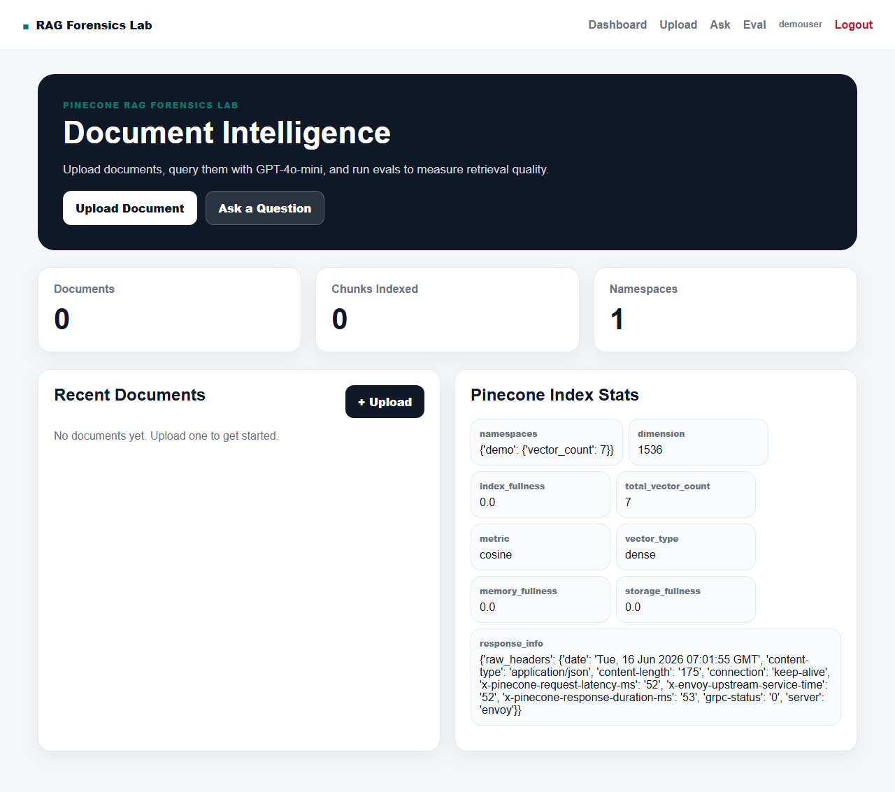
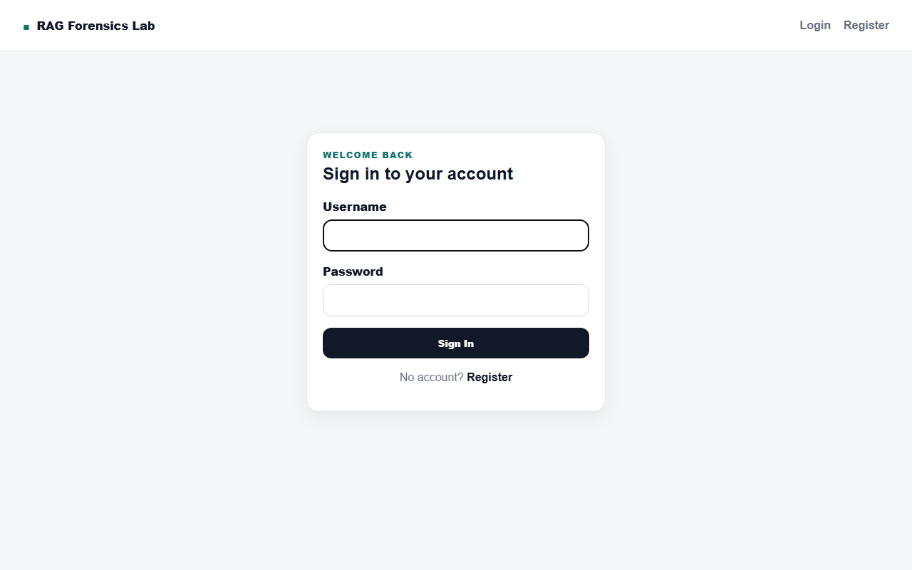
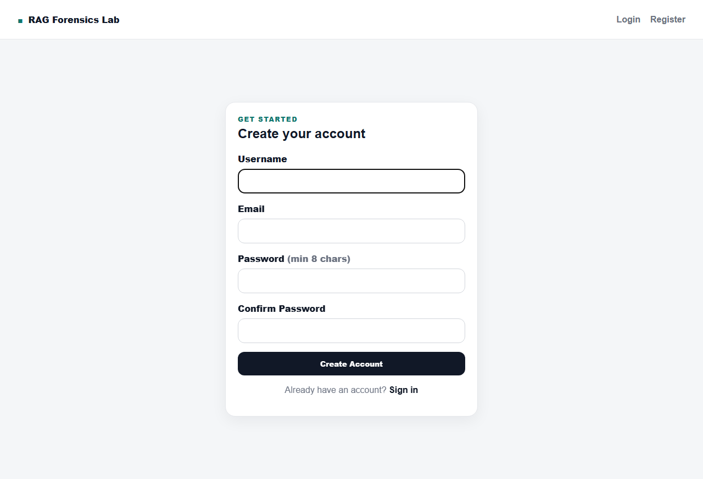
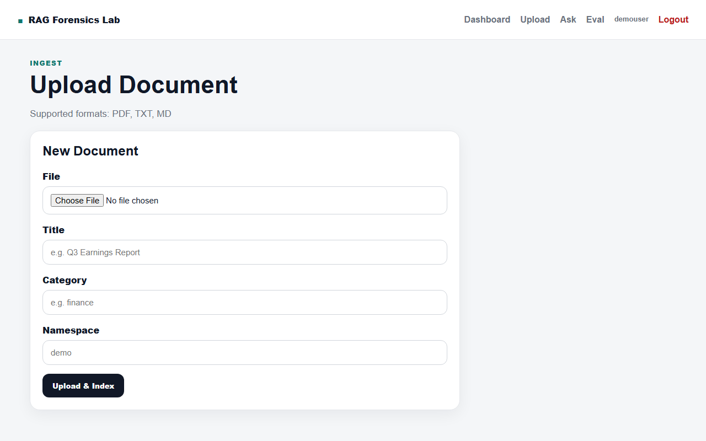
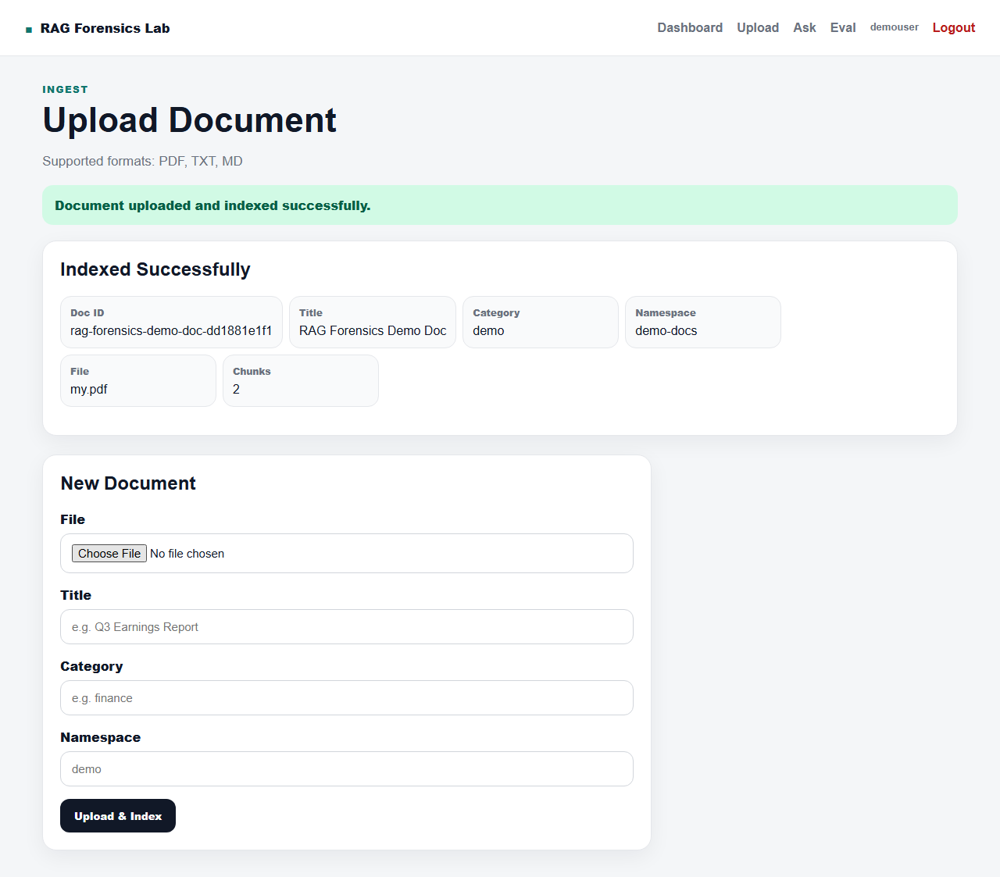
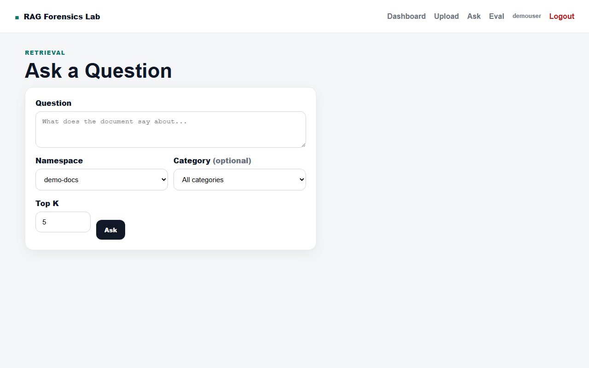
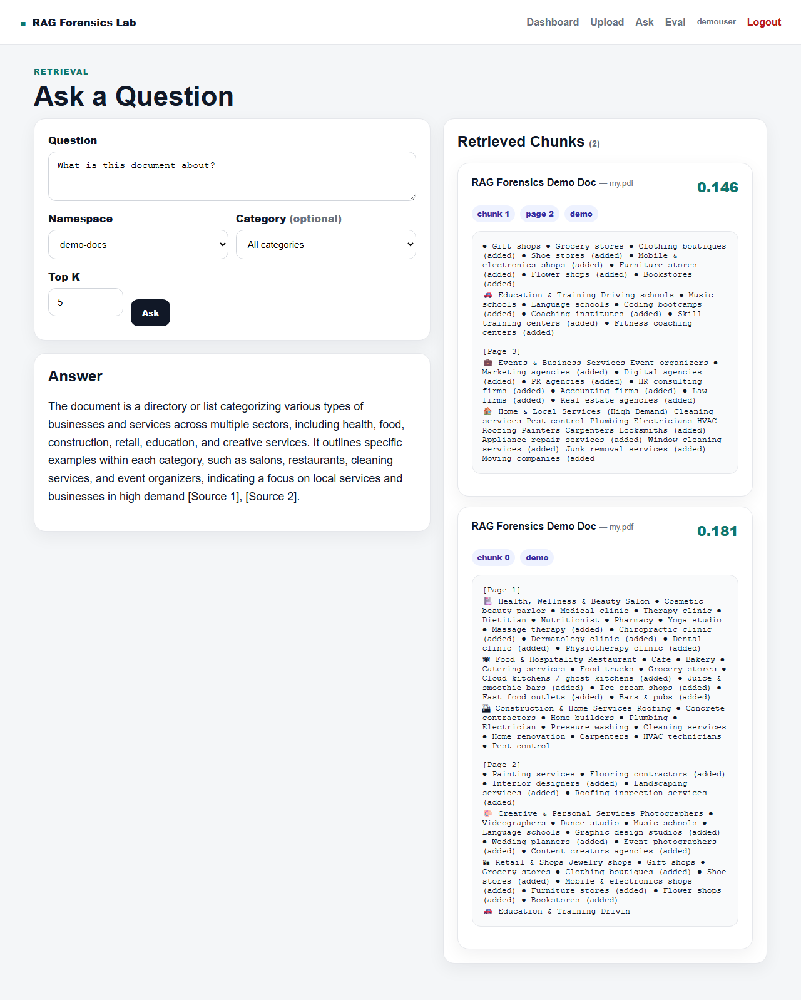
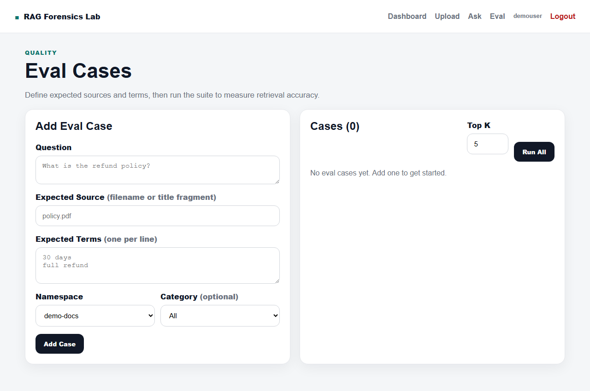

<div align="center">

# 🔬 Pinecone RAG Forensics Lab

**A production-quality Retrieval-Augmented Generation platform with per-user document isolation, semantic search, and built-in evaluation tooling.**

[](https://python.org)
[](https://fastapi.tiangolo.com)
[](https://pinecone.io)
[](https://openai.com)
[](https://sqlite.org)
[](LICENSE)

<br/>



</div>

---

## 📋 Table of Contents

- [About](#-about)
- [Features](#-features)
- [Tech Stack](#-tech-stack)
- [Architecture](#-architecture)
- [Screenshots](#-screenshots)
- [Quick Start](#-quick-start)
- [Configuration](#-configuration)
- [Usage Guide](#-usage-guide)
- [Project Structure](#-project-structure)
- [API Reference](#-api-reference)
- [How RAG Works Here](#-how-rag-works-here)
- [Contributing](#-contributing)

---

## 🧠 About

Pinecone RAG Forensics Lab is a **full-stack RAG application** built for developers who want to understand, experiment with, and evaluate retrieval-augmented generation pipelines. Upload your documents, ask natural-language questions, and use the built-in eval suite to measure how well your retrieval is performing — all with per-user data isolation so multiple users can work independently.

> **Forensics** = you see *everything*: retrieved chunk text, similarity scores, page numbers, chunk indices, and which sources contributed to the final answer.

---

## ✨ Features

| Feature | Description |
|---|---|
| 🔐 **User Auth** | Register/login with bcrypt passwords, 7-day JWT session cookies |
| 📄 **Document Ingestion** | Upload PDF, TXT, MD — auto-chunked with sentence-boundary awareness |
| 🔍 **Semantic Search** | Natural-language queries via Pinecone cosine similarity search |
| 🤖 **Answer Generation** | GPT-4o-mini synthesizes answers from top-K retrieved chunks with inline citations |
| 🏢 **Per-User Isolation** | Each user's documents scoped to their own Pinecone namespace and SQLite rows |
| 🎯 **Eval Suite** | Define test cases with expected sources + terms; run to get pass/fail scores |
| 🔎 **Full Trace View** | See every retrieved chunk: score, page, chunk index, raw text |
| ⚙️ **Config Driven** | All models, dimensions, and paths controlled via `.env` |

---

## 🛠 Tech Stack

| Layer | Technology |
|---|---|
| **Web Framework** | FastAPI 0.115+ with Starlette 1.x |
| **Templating** | Jinja2 3.x (server-rendered HTML) |
| **Vector Database** | Pinecone Serverless (cosine metric, 1536-dim) |
| **Embeddings** | OpenAI `text-embedding-3-small` |
| **LLM** | OpenAI `gpt-4o-mini` |
| **PDF Parsing** | pypdf 5.x |
| **Database** | SQLite via SQLAlchemy 2.0 ORM |
| **Auth** | bcrypt 4.x + python-jose JWT (HTTP-only cookies) |
| **Server** | Uvicorn (ASGI) |
| **Frontend** | Vanilla HTML/CSS (no JS framework) |

---

## 🏗 Architecture

```
Browser
  │
  ▼
FastAPI (app/main.py)
  │
  ├── Auth (app/auth.py)
  │     JWT decode ──► SQLite users table
  │
  ├── /upload ──► document_parser ──► chunker ──► embedding ──► Pinecone upsert
  │                                                               SQLite documents
  │
  ├── /ask ──► embedding (query) ──► Pinecone query ──► GPT-4o-mini ──► answer
  │
  └── /eval ──► list eval cases ──► run_eval_case ──► answer_question
                                          │
                                          └── check source match + term match
```

### Chunking Strategy

```
Raw text
  │
  ├── clean_text()  →  strip nulls, collapse whitespace/newlines
  │
  └── chunk_text()
        chunk_size = 1400 chars
        overlap    = 220 chars
        boundary   = finds last ". "  "? "  "! "  "\n\n"
                     within the chunk (never cuts mid-sentence)
        page_num   = inferred from [Page N] markers in PDF output
```

---

## 📸 Screenshots

### Login & Register

| Login | Register |
|---|---|
|  |  |

### Dashboard


The dashboard shows your document count, indexed chunks, Pinecone namespace stats, and a live list of your recent uploads.

### Upload a Document

| Upload Form | Indexed Successfully |
|---|---|
|  |  |

Paste a title, pick a category and namespace, then select a PDF/TXT/MD file. The pipeline chunks, embeds, and upserts to Pinecone in one shot.

### Ask a Question

| Ask Form | Answer + Chunk Trace |
|---|---|
|  |  |

Type a natural-language question. The right panel shows every retrieved chunk with its similarity score, page number, and raw text so you can verify what the model is reading.

### Eval Suite



Define expected sources and keyword terms, then click **Run All** to get a pass/fail report across your test cases.

---

## 🚀 Quick Start

### Prerequisites

- Python **3.10+**
- An [OpenAI API key](https://platform.openai.com/api-keys)
- A [Pinecone API key](https://app.pinecone.io/) (free Serverless tier works)

### 1 — Clone the repo

```bash
git clone https://github.com/Sagar-Sah/pinecone_rag_forensics.git
cd pinecone_rag_forensics
```

### 2 — Create a virtual environment

```bash
python -m venv venv

# Windows
venv\Scripts\activate

# macOS / Linux
source venv/bin/activate
```

### 3 — Install dependencies

```bash
pip install -r requirements.txt
```

### 4 — Configure environment variables

Copy the example and fill in your keys:

```bash
cp .env.example .env
```

Edit `.env`:

```env
OPENAI_API_KEY=sk-...
PINECONE_API_KEY=pcsk_...
PINECONE_INDEX_NAME=rag-forensics-lab
SECRET_KEY=your-long-random-secret-key-here
```

> Generate a secure `SECRET_KEY`:
> ```bash
> python -c "import secrets; print(secrets.token_hex(32))"
> ```

### 5 — Run the server

```bash
uvicorn app.main:app --host 0.0.0.0 --port 8000 --reload
```

Open **http://localhost:8000** — you'll be redirected to the login page. Register an account and start uploading.

---

## ⚙️ Configuration

All settings are read from `.env` at startup via `app/config.py`.

| Variable | Default | Required | Description |
|---|---|---|---|
| `OPENAI_API_KEY` | — | **Yes** | OpenAI API key for embeddings + chat |
| `PINECONE_API_KEY` | — | **Yes** | Pinecone API key |
| `PINECONE_INDEX_NAME` | — | **Yes** | Index name (auto-created if missing) |
| `SECRET_KEY` | `change-me-...` | **Yes (prod)** | JWT signing secret |
| `PINECONE_CLOUD` | `aws` | No | Cloud provider for Serverless index |
| `PINECONE_REGION` | `us-east-1` | No | Region for Serverless index |
| `EMBEDDING_MODEL` | `text-embedding-3-small` | No | OpenAI embedding model |
| `EMBEDDING_DIMENSION` | `1536` | No | Vector dimension (must match model) |
| `CHAT_MODEL` | `gpt-4o-mini` | No | OpenAI chat model |
| `UPLOAD_DIR` | `uploads` | No | Directory for saved upload files |
| `SQLITE_URL` | `sqlite:///data/app.db` | No | SQLAlchemy database URL |

> **Changing `EMBEDDING_MODEL`?** You must also update `EMBEDDING_DIMENSION` to match, and re-index all documents — the Pinecone index dimension is fixed at creation time.

---

## 📖 Usage Guide

### Uploading Documents

1. Click **Upload** in the top navigation
2. Select a file (PDF, TXT, or Markdown)
3. Fill in **Title** and **Category** (used for filtering)
4. Set a **Namespace** — defaults to `user-{your_id}` (keeps your data isolated)
5. Click **Upload & Index**

The pipeline will:
- Parse the file (extract text from all PDF pages)
- Split into overlapping chunks (~1 400 chars, 220-char overlap, sentence-aware)
- Generate embeddings via `text-embedding-3-small`
- Upsert all chunk vectors to Pinecone
- Record the document metadata in SQLite

### Asking Questions

1. Click **Ask** in the top navigation
2. Type your question in natural language
3. Select the **Namespace** containing your documents
4. Optionally filter by **Category**
5. Set **Top K** (number of chunks to retrieve — default 5, max 20)
6. Click **Ask**

The answer panel shows the GPT-4o-mini response with `[Source N]` citations. The right panel traces every retrieved chunk with:
- **Score** — cosine similarity (higher = more relevant)
- **Chunk index** and **page number**
- **Raw chunk text** — exactly what the model read

### Running Evals

1. Click **Eval** in the navigation
2. Under **Add Eval Case**, define:
   - **Question** — what you'll ask
   - **Expected Source** — filename or title fragment that should appear in results
   - **Expected Terms** (one per line) — keywords that must appear in the answer
3. Click **Add Case**
4. Click **Run All** — each case is graded:
   - ✅ **Pass** — expected source found in retrieved chunks AND all terms found in answer
   - ❌ **Fail** — source missing or one or more terms absent from answer

---

## 📁 Project Structure

```
pinecone_rag_forensics/
│
├── app/
│   ├── main.py              # FastAPI routes (auth, upload, ask, eval)
│   ├── auth.py              # JWT creation/decode, bcrypt hashing
│   ├── config.py            # Settings dataclass (reads .env)
│   ├── database.py          # SQLAlchemy models (User, Document, EvalCase)
│   ├── document_parser.py   # PDF + TXT/MD extraction
│   ├── chunker.py           # Sentence-aware text chunker
│   ├── embedding.py         # OpenAI embed_texts, embed_query, generate_answer
│   ├── pinecone_client.py   # Pinecone index management, upsert, query
│   ├── rag.py               # Orchestration: ingest_document, answer_question
│   ├── evals.py             # run_eval_case: source + term checking
│   │
│   ├── templates/
│   │   ├── base.html        # Shared layout + auth-aware topbar
│   │   ├── index.html       # Dashboard
│   │   ├── upload.html      # Upload form + result
│   │   ├── ask.html         # Ask form + answer + chunk trace
│   │   ├── eval.html        # Eval cases + run results
│   │   ├── login.html       # Login form
│   │   └── register.html    # Register form
│   │
│   └── static/
│       └── style.css        # CSS design system (CSS variables + responsive)
│
├── data/                    # Auto-created — SQLite database lives here
├── uploads/                 # Auto-created — uploaded files stored here
├── docs/
│   └── screenshots/         # README screenshots
│
├── requirements.txt
├── .env                     # Your secrets (never commit this)
├── .env.example             # Template — safe to commit
└── README.md
```

---

## 🔌 API Reference

All routes return HTML (Jinja2 templates) except `/health`.

| Method | Path | Auth | Description |
|---|---|---|---|
| `GET` | `/` | Required | Dashboard with stats and recent docs |
| `GET` | `/register` | Public | Registration page |
| `POST` | `/register` | Public | Create account, issue JWT cookie, redirect to `/` |
| `GET` | `/login` | Public | Login page |
| `POST` | `/login` | Public | Verify credentials, issue JWT cookie, redirect to `/` |
| `GET` | `/logout` | — | Clear JWT cookie, redirect to `/login` |
| `GET` | `/upload` | Required | Upload form |
| `POST` | `/upload` | Required | Ingest document into Pinecone |
| `GET` | `/ask` | Required | Ask form |
| `POST` | `/ask` | Required | Retrieve + generate answer |
| `GET` | `/eval` | Required | Eval cases list |
| `POST` | `/eval/add` | Required | Add an eval case |
| `POST` | `/eval/run` | Required | Run all eval cases, show results |
| `GET` | `/health` | Public | `{"status": "ok"}` |

---

## 🧬 How RAG Works Here

```
1. INGEST
   ┌─────────────┐    ┌──────────────┐    ┌──────────────────┐    ┌─────────┐
   │  Upload file │───►│ Parse + chunk│───►│ Embed (OpenAI)   │───►│ Pinecone│
   └─────────────┘    └──────────────┘    └──────────────────┘    └─────────┘
                             │                                           │
                             └──────── metadata ──────────► SQLite ─────┘

2. QUERY
   ┌──────────┐    ┌───────────────┐    ┌──────────┐    ┌───────────────┐
   │ Question │───►│ Embed question│───►│ Pinecone │───►│ Top-K chunks  │
   └──────────┘    └───────────────┘    │  search  │    │ with metadata │
                                        └──────────┘    └───────┬───────┘
                                                                 │
                                                    ┌────────────▼────────────┐
                                                    │  GPT-4o-mini            │
                                                    │  "Answer from sources   │
                                                    │   only, cite inline"    │
                                                    └────────────┬────────────┘
                                                                 │
                                                         Answer + citations

3. EVAL
   For each test case:
   ├── Run the full QUERY pipeline
   ├── Check: expected_source in {source_file, title} of any retrieved chunk?
   ├── Check: each expected_term in the generated answer?
   └── Pass if both checks pass
```

---

## 🔒 Authentication Flow

```
Register ──► bcrypt hash password ──► store in users table
         ──► create JWT {sub: user_id, exp: now+7d}
         ──► set httponly cookie "access_token"
         ──► redirect to /

Login    ──► lookup user by username
         ──► bcrypt.checkpw(submitted, stored_hash)
         ──► if match: issue JWT cookie, redirect to /
         ──► if no match: 401 + error message

Every
request  ──► read cookie "access_token"
         ──► decode JWT with SECRET_KEY
         ──► load User from SQLite by user_id
         ──► None → redirect to /login
         ──► User → proceed, all DB queries scoped to user.id

Logout   ──► delete_cookie("access_token")
         ──► redirect to /login
```

---

## 📷 Re-capturing Screenshots

Screenshots in `docs/screenshots/` were generated automatically. To refresh them after UI changes, start the server and run:

```bash
pip install playwright
playwright install chromium
python take_screenshots.py
```

The script (`take_screenshots.py` at the project root) logs in as `demouser`, uploads a sample PDF, asks a question, and saves 8 full-page PNGs.

---

## 🤝 Contributing

1. Fork the repository
2. Create a feature branch: `git checkout -b feature/my-feature`
3. Commit your changes: `git commit -m "feat: add my feature"`
4. Push to the branch: `git push origin feature/my-feature`
5. Open a Pull Request

### Code Style

- Python 3.10+ type hints throughout
- SQLAlchemy 2.0 declarative ORM (no legacy `Base.query`)
- No bare `from config import` — always `from app.config import`
- Templates use Starlette 1.x API: `TemplateResponse(request, name, context)`

---

## 📄 License

MIT License — see [LICENSE](LICENSE) for details.

---

<div align="center">

Built with FastAPI · Pinecone · OpenAI · SQLAlchemy

**[⬆ Back to top](#-pinecone-rag-forensics-lab)**

</div>
